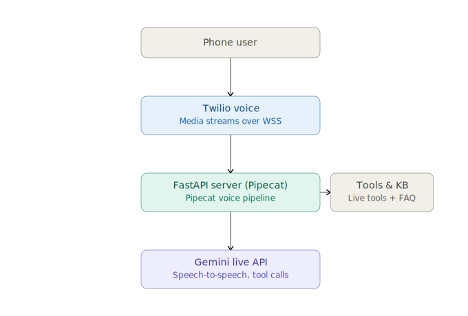

# 🤖 AI Voice Agent

A real-time AI voice agent prototype that makes outbound phone calls and conducts natural voice conversations using **Pipecat**, **Google Gemini Live API**, and **Twilio Voice**.

## ✨ Features

- **Real-time Voice Conversation**: Bidirectional speech-to-speech AI conversations with low latency
- **Outbound Calling**: Initiates phone calls via Twilio
- **Bilingual Support**: Understands and responds in both English and Malayalam (മലയാളം)
- **Tool Calling**: AI can invoke tools during conversation (date/time, weather, knowledge base)
- **Knowledge Base**: Answers company-specific questions from a local JSON knowledge base
- **Barge-in Support**: User can interrupt the AI mid-speech
- **Conversation Memory**: Maintains context throughout the entire call
- **Event Logging**: Structured logs for call events, tool invocations, and errors

## 🏗️ Architecture

The AI Voice Agent uses an event-driven, real-time voice pipeline built on FastAPI and the Pipecat framework. 

* **Telephony Integration**: Twilio Voice connects the phone call to our FastAPI server using standard WebSockets (via Twilio Media Streams).
* **Audio Processing & VAD**: The Pipecat voice pipeline receives the stream, executes Voice Activity Detection (VAD) locally using the Silero model, and manages bidirectional turn-taking.
* **Brain (LLM & Tools)**: Audio frames are routed to/from the Gemini Live API, which acts as the core brain. Gemini handles low-latency speech-to-speech interaction and dynamically invokes tools (like date/time lookup and the local FAQ knowledge base) when needed.



### Data Flow
1. **Outbound Call**: FastAPI triggers Twilio REST API → Twilio calls the user
2. **Audio Stream**: Twilio opens WebSocket → streams phone audio (G.711 µ-law)
3. **AI Processing**: Pipecat receives audio → sends to Gemini Live (speech-to-speech)
4. **Response**: Gemini generates audio response → Pipecat sends back via Twilio → user hears it

### Why Pipecat?
Pipecat is the preferred framework because:
- It handles audio serialization and transcoding between Twilio's G.711 µ-law (8kHz) and Gemini Live's PCM (24kHz) out-of-the-box via `TwilioFrameSerializer`.
- Native support for barge-in / interruption handling.
- Flexible `FastAPIWebsocketTransport` to integrate voice pipelines directly inside FastAPI routers.
- Pipeline-based architecture that makes it simple to integrate VAD (Voice Activity Detection), LLMs, and custom context aggregators.
- Production-grade framework aligned with modern conversational AI designs.

## 📋 Prerequisites

- **Python 3.11+**
- **Google AI Studio Account** (free) — for Gemini API key
- **Twilio Account** (free trial) — for phone calling
- **ngrok** (free) — to expose local server to Twilio

## 🚀 Setup Instructions

### 1. Clone the Repository

```bash
git clone https://github.com/Anandtech09/AI_Voice_Assistant.git
cd AI_Voice_Assistant
```

### 2. Create Virtual Environment

```bash
python -m venv venv

# Windows
venv\Scripts\activate

# macOS/Linux
source venv/bin/activate
```

### 3. Install Dependencies

```bash
pip install -r requirements.txt
```

### 4. Get API Credentials

#### Google Gemini API Key
1. Go to [Google AI Studio](https://ai.google.dev/aistudio)
2. Click "Create API Key"
3. Copy the key

#### Twilio Account
1. Sign up at [Twilio](https://www.twilio.com/try-twilio)
2. From the Dashboard, copy:
   - **Account SID**
   - **Auth Token**
3. Get a phone number:
   - Go to Phone Numbers → Buy a Number
   - Get a number with Voice capability
4. **Verify your phone number**:
   - Go to Phone Numbers → Verified Caller IDs
   - Add and verify the number you want to call

#### ngrok
1. Download from [ngrok.com](https://ngrok.com/download)
2. Install and authenticate (if needed)

### 5. Configure Environment Variables

```bash
# Copy the template
cp .env.example .env

# Edit .env and fill in your credentials
```

Fill in these values in `.env`:
```
GEMINI_API_KEY=your_actual_gemini_key
TWILIO_ACCOUNT_SID=your_actual_sid
TWILIO_AUTH_TOKEN=your_actual_token
TWILIO_PHONE_NUMBER=+1XXXXXXXXXX
YOUR_PHONE_NUMBER=+91XXXXXXXXXX
NGROK_URL=https://xxxx.ngrok-free.app
```

### 6. Start ngrok

In a **separate terminal**:
```bash
ngrok http 8000
```

Copy the HTTPS URL (e.g., `https://abcd-1234.ngrok-free.app`) and update `NGROK_URL` in your `.env` file.

### 7. Run the Server

```bash
# On Windows (recommended to avoid emoji logging errors):
python -X utf8 -m app.main

# On macOS/Linux:
python -m app.main
```

Or using uvicorn directly:
```bash
# On Windows:
python -X utf8 -m uvicorn app.main:app --host 0.0.0.0 --port 8000

# On macOS/Linux:
uvicorn app.main:app --host 0.0.0.0 --port 8000
```

### 8. Make a Test Call

Using curl:
```bash
curl -X POST http://localhost:8000/start-call
```

Or with a custom phone number:
```bash
curl -X POST http://localhost:8000/start-call \
  -H "Content-Type: application/json" \
  -d '{"to_number": "+91XXXXXXXXXX"}'
```

Or open your browser to `http://localhost:8000` to verify the server is running.

## 📁 Project Structure

```
AI_Voice_Assistant/
├── app/
│   ├── __init__.py          # Package init
│   ├── main.py              # FastAPI server + all endpoints
│   ├── bot.py               # Pipecat pipeline (Gemini Live + Twilio)
│   ├── config.py            # Environment variable loading & validation
│   ├── prompts.py           # System prompt (bilingual, tool-aware)
│   ├── tools.py             # Tool definitions (datetime, weather, KB)
│   ├── knowledge.py         # Knowledge base loader & search
│   ├── services/
│   │   ├── __init__.py
│   │   └── twilio_service.py  # Twilio REST API (outbound calls, TwiML)
│   └── utils/
│       ├── __init__.py
│       └── logger.py        # Structured logging
├── knowledge/
│   └── knowledge.json       # FAQ knowledge base (18 entries)
├── .env                     # Environment variables (not committed)
├── .env.example             # Template for .env
├── .gitignore               # Git ignore rules
├── requirements.txt         # Python dependencies
├── README.md                # This file
├── AI_USAGE.md              # AI tools usage documentation
└── understanding.md         # Project analysis & tracker
```

## 🧪 Testing the Features

### English Conversation
- Call is made → Answer the phone → Speak in English
- The AI should respond naturally in English

### Malayalam Conversation
- During the call, switch to speaking Malayalam
- The AI should detect and respond in Malayalam

### Tool Calling
- Ask: "What time is it?" → AI uses `get_current_datetime` tool
- Ask: "What's the weather in Kochi?" → AI uses `get_weather` tool (fetches live weather data)

### Knowledge Base
- Ask: "What services does TechNova offer?" → AI searches knowledge base
- Ask: "What are your pricing plans?" → AI responds from KB

### Barge-in
- While the AI is speaking, start talking
- The AI should stop and listen to your new input

### Conversation Memory
- Mention your name at the start
- Later ask "Do you remember my name?" → AI should recall it

## 🔧 API Endpoints

| Method | Path | Description |
|--------|------|-------------|
| GET | `/` | Health check |
| POST | `/start-call` | Initiate outbound call |
| POST | `/twiml` | TwiML webhook for Twilio |
| POST | `/call-status` | Call status callback |
| WS | `/ws` | Twilio Media Stream WebSocket |

## 📝 Notes

- This is a **prototype**, not a production application
- Weather data is **mocked** for the prototype (replace with real API for production)
- Twilio trial accounts can only call **verified numbers**
- The ngrok URL **changes** each time you restart ngrok (update `.env` accordingly)
- For stable URLs, consider ngrok paid plan or deploy to a cloud platform

## 📚 References

- [Pipecat Documentation](https://docs.pipecat.ai/)
- [Gemini Live API](https://ai.google.dev/gemini-api/docs/live-api/get-started-sdk)
- [Twilio Voice](https://www.twilio.com/docs/voice)
- [FastAPI](https://fastapi.tiangolo.com/)
- [ngrok](https://ngrok.com/docs)
