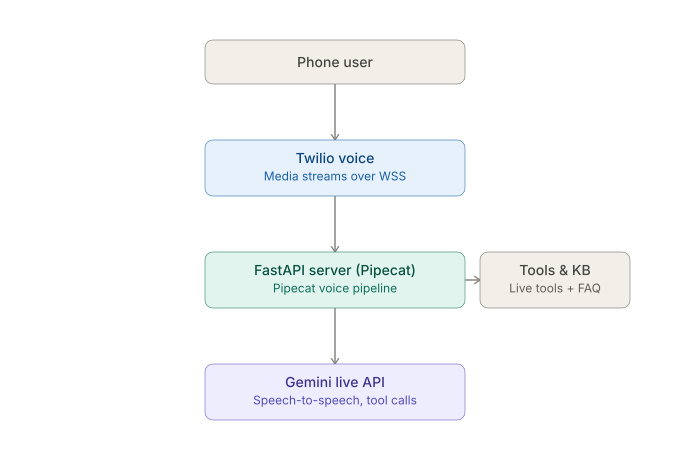

# 🏠 Stelar Interior — AI Voice Agent

A real-time AI voice agent for **Stelar Interior**, a premium interior design company. The agent handles inbound and outbound phone calls, acts as a professional receptionist, collects client details, and helps schedule free site visit consultations — all powered by **Pipecat**, **Google Gemini Live API**, and **Twilio Voice**.

## ✨ Features

- **Real-time Voice Conversation**: Bidirectional speech-to-speech AI conversations with low latency
- **Interior Design Receptionist**: Acts as a warm, knowledgeable interior design consultant
- **Client Info Collection**: Gathers name, contact, location, requirements, and preferred visit date
- **Visit Scheduling**: Helps callers pick a preferred date/time for a free site visit consultation
- **Smart Off-Topic Handling**: Redirects off-topic callers back to interior design; ends call gracefully after 3 off-topic attempts
- **No-Pricing Policy**: Never shares pricing over the phone — always redirects to a site visit
- **Bilingual Support**: Understands and responds in both English and Malayalam (മലയാളം)
- **Tool Calling**: AI invokes tools during conversation (date/time, weather, knowledge base)
- **Knowledge Base**: Answers company-specific questions from a local JSON knowledge base
- **Barge-in Support**: Caller can interrupt the AI mid-speech
- **Outbound & Inbound Calls**: Supports both outbound (API-triggered) and inbound (Twilio webhook) calls
- **Event Logging**: Structured logs for call events, tool invocations, and errors

## 🏗️ Architecture

The AI Voice Agent uses an event-driven, real-time voice pipeline built on FastAPI and the Pipecat framework. 

* **Telephony Integration**: Twilio Voice connects the phone call to our FastAPI server using standard WebSockets (via Twilio Media Streams).
* **Audio Processing & VAD**: The Pipecat voice pipeline receives the stream, executes Voice Activity Detection (VAD) locally using the Silero model, and manages bidirectional turn-taking.
* **Brain (LLM & Tools)**: Audio frames are routed to/from the Gemini Live API, which acts as the core brain. Gemini handles low-latency speech-to-speech interaction and dynamically invokes tools (like date/time lookup and the local knowledge base) when needed.



### Architecture Overview

The system follows a layered architecture:

1. **Client Layer**: The caller's phone connects through the PSTN network to Twilio's telephony infrastructure.
2. **Transport Layer**: Twilio opens a WebSocket Media Stream to our FastAPI server, streaming G.711 µ-law audio in real-time.
3. **Processing Layer**: Pipecat's pipeline handles audio serialization/transcoding (G.711 ↔ PCM), Voice Activity Detection via Silero VAD, and context aggregation for conversation memory.
4. **Intelligence Layer**: Google Gemini Live API performs speech-to-speech processing — understanding the caller's intent and generating natural audio responses. It also invokes registered tools (datetime, weather, knowledge base) when contextually appropriate.
5. **Response Path**: AI-generated audio flows back through Pipecat → Twilio → caller's phone, completing the real-time loop.

### Data Flow
1. **Outbound Call**: FastAPI triggers Twilio REST API → Twilio calls the user
2. **Audio Stream**: Twilio opens WebSocket → streams phone audio (G.711 µ-law)
3. **AI Processing**: Pipecat receives audio → sends to Gemini Live (speech-to-speech)
4. **Response**: Gemini generates audio response → Pipecat sends back via Twilio → user hears it

### Why Pipecat?
Pipecat is the preferred framework because:
- It handles audio serialization and transcoding between Twilio's G.711 µ-law (8kHz) and Gemini Live's PCM (24kHz) out-of-the-box via `TwilioFrameSerializer`.
- Native support for barge-in / interruption handling.
- Flexible `FastAPIWebsocketTransport` to integrate voice pipelines directly inside FastAPI routers.
- Pipeline-based architecture that makes it simple to integrate VAD (Voice Activity Detection), LLMs, and custom context aggregators.
- Production-grade framework aligned with modern conversational AI designs.
- Connecting Twilio directly to Gemini's Multimodal Live API over raw WebSockets requires managing audio encoding mismatches, interruption pipelines, and frame buffering yourself.

## 📋 Prerequisites

- **Python 3.11+**
- **Google AI Studio Account** (free) — for Gemini API key
- **Twilio Account** (free trial) — for phone calling
- **ngrok** (free) — to expose local server to Twilio

## 🚀 Setup Instructions

### 1. Clone the Repository

```bash
git clone https://github.com/Anandtech09/AI_Voice_Assistant.git
cd AI_Voice_Assistant
```

### 2. Create Virtual Environment

```bash
python -m venv venv

# Windows
venv\Scripts\activate

# macOS/Linux
source venv/bin/activate
```

### 3. Install Dependencies

```bash
pip install -r requirements.txt
```

### 4. Get API Credentials

#### Google Gemini API Key
1. Go to [Google AI Studio](https://ai.google.dev/aistudio)
2. Click "Create API Key"
3. Copy the key

#### Twilio Account
1. Sign up at [Twilio](https://www.twilio.com/try-twilio)
2. From the Dashboard, copy:
   - **Account SID**
   - **Auth Token**
3. Get a phone number:
   - Go to Phone Numbers → Buy a Number
   - Get a number with Voice capability
4. **Verify your phone number**:
   - Go to Phone Numbers → Verified Caller IDs
   - Add and verify the number you want to call

#### ngrok
1. Download from [ngrok.com](https://ngrok.com/download)
2. Install and authenticate (if needed)

### 5. Configure Environment Variables

```bash
# Copy the template
cp .env.example .env

# Edit .env and fill in your credentials
```

Fill in these values in `.env`:
```
GEMINI_API_KEY=your_actual_gemini_key
TWILIO_ACCOUNT_SID=your_actual_sid
TWILIO_AUTH_TOKEN=your_actual_token
TWILIO_PHONE_NUMBER=+1XXXXXXXXXX
YOUR_PHONE_NUMBER=+91XXXXXXXXXX
NGROK_URL=https://xxxx.ngrok-free.app
```

### 6. Start ngrok

In a **separate terminal**:
```bash
ngrok http 8000
```

Copy the HTTPS URL (e.g., `https://abcd-1234.ngrok-free.app`) and update `NGROK_URL` in your `.env` file.

### 7. Run the Server

```bash
# On Windows (recommended to avoid emoji logging errors):
python -X utf8 -m app.main

# On macOS/Linux:
python -m app.main
```

Or using uvicorn directly:
```bash
# On Windows:
python -X utf8 -m uvicorn app.main:app --host 0.0.0.0 --port 8000

# On macOS/Linux:
uvicorn app.main:app --host 0.0.0.0 --port 8000
```

### 8. Make a Test Call

Using curl:
```bash
curl -X POST http://localhost:8000/start-call
```

Or with a custom phone number:
```bash
curl -X POST http://localhost:8000/start-call \
  -H "Content-Type: application/json" \
  -d '{"to_number": "+91XXXXXXXXXX"}'
```

Or open your browser to `http://localhost:8000` to verify the server is running.

## 📁 Project Structure

```
AI_Voice_Assistant/
├── app/
│   ├── __init__.py          # Package init
│   ├── main.py              # FastAPI server + all endpoints
│   ├── bot.py               # Pipecat pipeline (Gemini Live + Twilio)
│   ├── config.py            # Environment variable loading & validation
│   ├── prompts.py           # System prompt (Stelar Interior receptionist)
│   ├── tools.py             # Tool definitions (datetime, weather, KB, call summary)
│   ├── knowledge.py         # Knowledge base loader & inverted-index search
│   ├── services/
│   │   ├── __init__.py
│   │   └── twilio_service.py  # Twilio REST API (outbound calls, TwiML)
│   └── utils/
│       ├── __init__.py
│       ├── logger.py        # Structured logging
│       └── call_summary.py  # Writes call summary .txt files
├── knowledge/
│   └── knowledge.json       # Stelar Interior knowledge base (20 entries)
├── tests/
│   ├── __init__.py
│   ├── conftest.py          # Pytest configuration
│   ├── test_unit.py         # 48 unit tests
│   └── test_integration.py  # 24 integration tests
├── call_logs/               # Auto-generated call summaries (git-ignored)
│   └── call_2026-08-15_14-30-00.txt  # Example: one summary per call
├── .env                     # Environment variables (not committed)
├── .env.example             # Template for .env
├── .gitignore               # Git ignore rules
├── pytest.ini               # Pytest configuration
├── requirements.txt         # Python dependencies
├── README.md                # This file
├── AI_USAGE.md              # AI tools usage documentation
└── understanding.md         # Project analysis & tracker
```

## 🧪 Testing the Features

### Interior Design Conversation
- Call is made → Answer the phone → Ask about interior design services
- The AI should respond with Stelar Interior's service information

### Visit Scheduling
- Ask: "I want to schedule a site visit" → AI collects your details and preferred date
- Ask: "Can I book for Saturday?" → AI notes the preference and says team will confirm

### Off-Topic Handling
- Talk about unrelated topics → AI redirects you to interior design
- After 3 off-topic attempts → AI gracefully ends the call

### Pricing Questions
- Ask: "How much does a modular kitchen cost?" → AI says pricing is only available after a site visit

### Knowledge Base
- Ask: "What services does Stelar Interior offer?" → AI searches knowledge base
- Ask: "What materials do you use?" → AI responds from KB

### Bilingual Support
- Switch to speaking Malayalam during the call
- The AI should detect and respond in Malayalam

### Tool Calling
- Ask: "What time is it?" → AI uses `get_current_datetime` tool
- Ask: "What's the weather in Kochi?" → AI uses `get_weather` tool (live data)

### Barge-in
- While the AI is speaking, start talking
- The AI should stop and listen to your new input

## 🔧 API Endpoints

| Method | Path | Description |
|--------|------|-------------|
| GET | `/` | Health check (also shows webhook URL) |
| POST | `/start-call` | Initiate a single outbound call |
| POST | `/bulk-call` | Initiate outbound calls to multiple numbers |
| GET/POST | `/twiml` | TwiML webhook — **set this as your Twilio inbound webhook** |
| POST | `/call-status` | Call status callback from Twilio |
| WS | `/ws` | Twilio Media Stream WebSocket (AI pipeline runs here) |

## 📞 Outbound Call (AI calls you)

```bash
# Call the default number (YOUR_PHONE_NUMBER from .env)
curl -X POST http://localhost:8000/start-call

# Call a specific number
curl -X POST http://localhost:8000/start-call \
  -H "Content-Type: application/json" \
  -d '{"to_number": "+919876543210"}'
```

## 📲 Inbound Call (Customer calls your Twilio number → AI answers)

**One-time setup in Twilio Console:**
1. Go to [Twilio Console](https://console.twilio.com/) → Phone Numbers → Manage → Active Numbers
2. Click your Twilio phone number
3. Under **Voice Configuration** → **"A Call Comes In"**:
   - Set to **Webhook**
   - URL: `https://<your-ngrok-url>/twiml`
   - Method: **HTTP POST**
4. Click **Save Configuration**

Now when anyone calls your Twilio number, the AI receptionist will answer automatically.

> **Note:** The ngrok URL changes every time you restart ngrok. Update the webhook URL in Twilio Console each time, or use a paid ngrok plan for a stable URL.

## 📋 Bulk Outbound Calls (from Excel / phone list)

If you have a list of phone numbers (e.g., from an Excel sheet), you can call them all sequentially:

```bash
# Call multiple numbers with 5 second delay between each
curl -X POST http://localhost:8000/bulk-call \
  -H "Content-Type: application/json" \
  -d '{
    "numbers": ["+919876543210", "+919876543211", "+919876543212"],
    "delay_seconds": 5
  }'
```

### How to use with Excel:
1. Open your Excel file with phone numbers
2. Copy the phone number column
3. Format them as a JSON array: `["+91...", "+91...", "+91..."]`
4. POST to `/bulk-call`

Or use a simple Python script:
```python
import pandas as pd
import requests

# Read numbers from Excel
df = pd.read_excel("client_numbers.xlsx")
numbers = df["phone"].tolist()

# Call all numbers
response = requests.post(
    "http://localhost:8000/bulk-call",
    json={"numbers": numbers, "delay_seconds": 5}
)
print(response.json())
```

Each call generates its own `call_logs/*.txt` summary file for the team.

> **Note:** Twilio trial accounts can only call verified numbers. On a paid account, you can call any number.

## 🧪 Running Tests

The project includes **72 automated tests** (48 unit + 24 integration). Install test dependencies and run:

```bash
pip install pytest pytest-asyncio httpx

# Run all tests
python -X utf8 -m pytest tests/ -v

# Run only unit tests
python -X utf8 -m pytest tests/test_unit.py -v

# Run only integration tests
python -X utf8 -m pytest tests/test_integration.py -v
```

### Test Coverage

| Category | Tests | What's Tested |
|---|---|---|
| Knowledge Base Index | 9 | Inverted index build, search, phrase matching, stop words, edge cases |
| Call Summary | 5 | File creation, content validation, missing fields, unique filenames |
| Tool Definitions | 6 | Schema structure, required params, all 4 tools defined |
| Tool Handlers | 8 | Datetime, weather, KB search, call summary — with mocked deps |
| Config/Settings | 4 | URL generation, defaults, API URLs |
| System Prompt | 8 | Stelar Interior branding, pricing policy, off-topic rules, bilingual |
| Knowledge JSON | 6 | Data integrity, no TechNova refs, pricing redirects to visit |
| FastAPI Endpoints | 11 | Health check, TwiML, call-status, start-call (mocked Twilio) |
| KB End-to-End | 8 | Real knowledge.json search for services, materials, visit, warranty |
| Pipeline Integration | 5 | Tool→file pipeline, schema↔handler consistency |

## 📝 Notes

- This is a **prototype** built for Stelar Interior's client engagement workflow
- Twilio trial accounts can only call **verified numbers**
- The ngrok URL **changes** each time you restart ngrok (update `.env` accordingly)
- For stable URLs, consider ngrok paid plan or deploy to a cloud platform
- Weather data is fetched live from the Open-Meteo public API

## 📚 References

- [Pipecat Documentation](https://docs.pipecat.ai/)
- [Gemini Live API](https://ai.google.dev/gemini-api/docs/live-api/get-started-sdk)
- [Twilio Voice](https://www.twilio.com/docs/voice)
- [FastAPI](https://fastapi.tiangolo.com/)
- [ngrok](https://ngrok.com/docs)